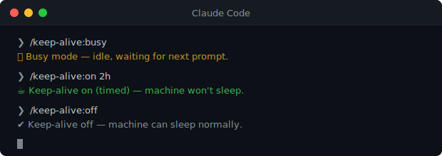

<div align="center">

# ☕ Claude Code Keep Alive Plugin

> Keep your machine awake while Claude works.

[](https://github.com/mrzeszowski/claude-code-keep-alive/actions/workflows/ci.yml)
[](LICENSE)
[](https://github.com/mrzeszowski/claude-code-keep-alive/releases)
[](#how-it-works)



</div>

A [Claude Code](https://docs.claude.com/en/docs/claude-code) plugin that prevents your machine from sleeping during long Claude Code sessions. Inspired by GitHub Copilot CLI's `/keep-alive` command.

## Install

Inside a Claude Code session:

```text
/plugin marketplace add mrzeszowski/claude-code-keep-alive
/plugin install keep-alive@claude-code-keep-alive
/reload-plugins
```

That's it. The plugin's four slash commands are now available under the `/keep-alive:` namespace.

## Usage

| Command | What it does |
| --- | --- |
| `/keep-alive:status` | Show current state. |
| `/keep-alive:on` | Inhibit sleep until you turn it off. |
| `/keep-alive:on 30m` | Inhibit sleep for 30 minutes. (`m`, `h`, `d` suffixes; bare number = minutes.) |
| `/keep-alive:off` | Release the inhibitor. |
| `/keep-alive:busy` | Inhibit sleep only while Claude is actively processing. Idle time is allowed to sleep. |

The `keep-alive:` prefix is the plugin namespace — every Claude Code plugin's commands are prefixed by the plugin's name to avoid collisions across plugins.

## How it works

- **macOS:** spawns a detached `caffeinate -dis` process.
- **Linux (systemd):** spawns a detached `systemd-inhibit --what=idle:sleep ... sleep` process.
- **Windows:** not yet supported in v0.1; contributions welcome.

State lives in `${XDG_CACHE_HOME:-$HOME/.cache}/claude-code-keep-alive/state` — a single global file shared across all your Claude Code sessions on this machine. `flock` (or a `mkdir`-based fallback on macOS) serializes concurrent invocations.

`busy` mode is driven by two hooks shipped with the plugin: `UserPromptSubmit` starts the inhibitor, `Stop` tears it down. Both are no-ops unless you've explicitly opted in with `/keep-alive:busy`.

## Updating

```text
/plugin update keep-alive@claude-code-keep-alive
```

You only receive updates when the plugin's `version` field is bumped (not on every commit).

## Uninstall

```text
/plugin uninstall keep-alive@claude-code-keep-alive
```

## Contributing

See [CONTRIBUTING.md](CONTRIBUTING.md).

## License

MIT — see [LICENSE](LICENSE).
